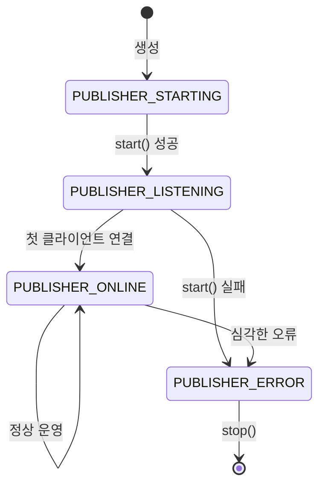
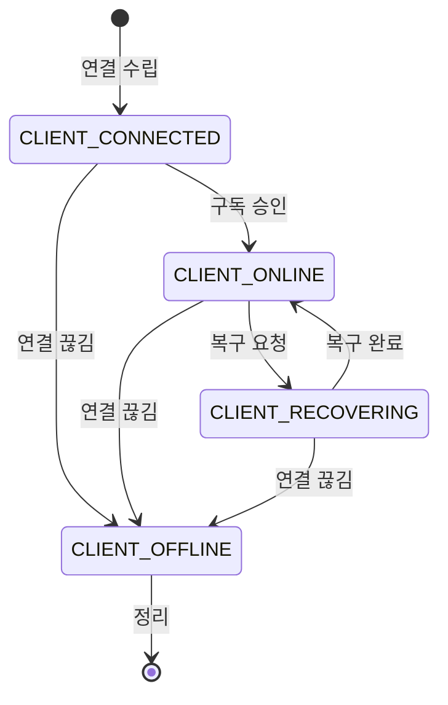
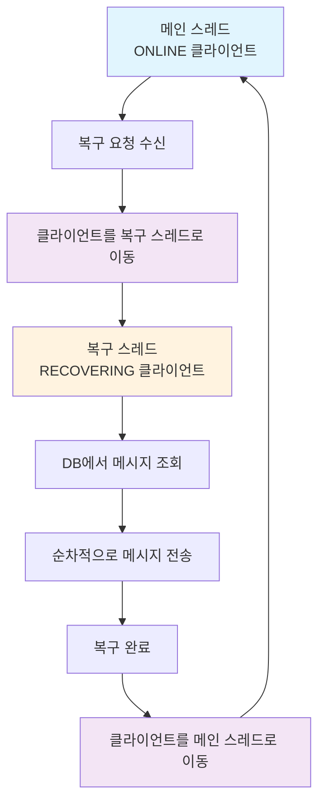
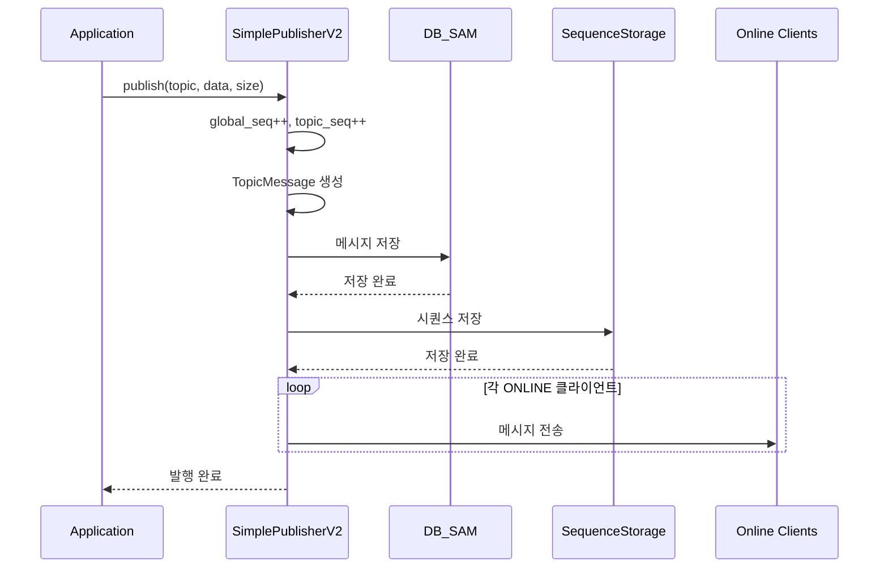
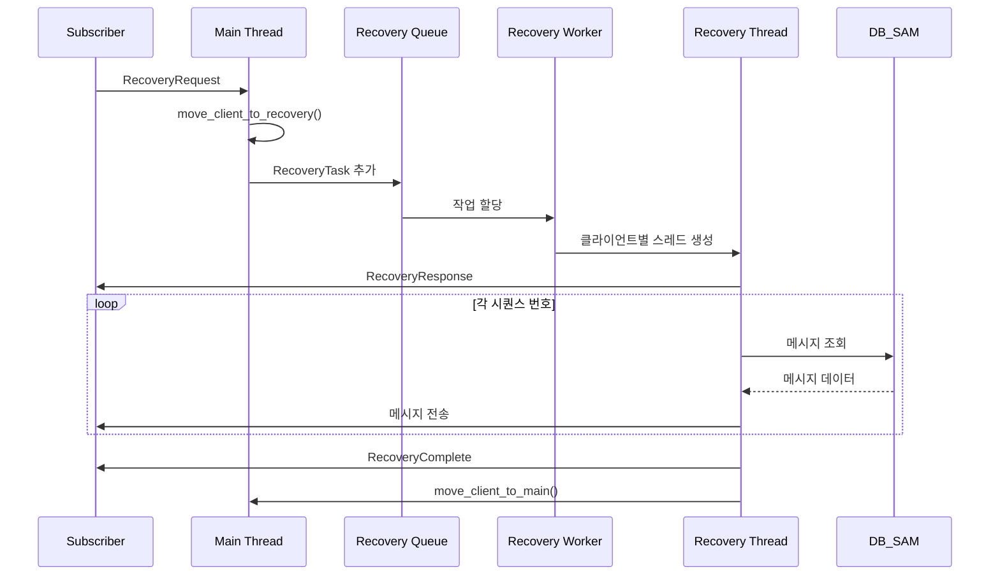
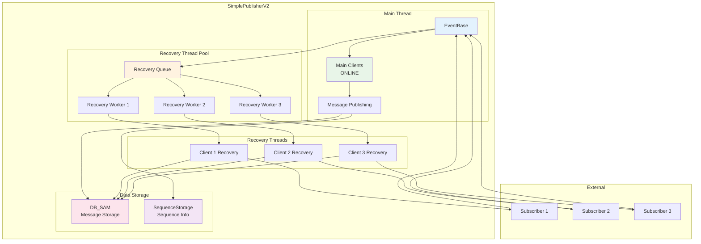
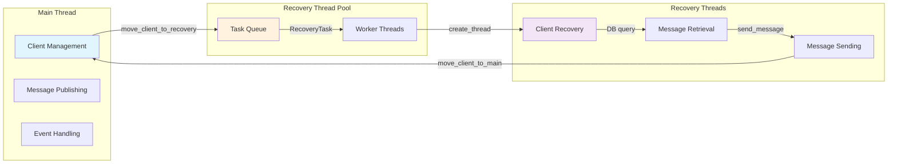
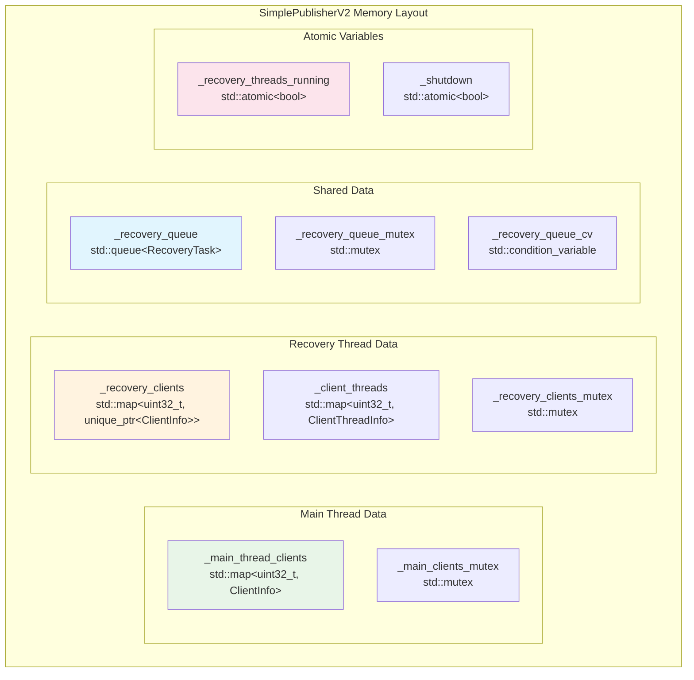
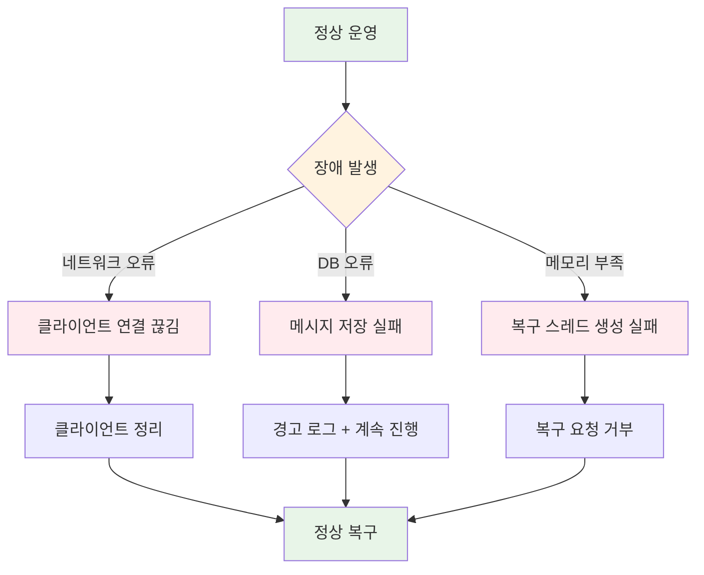

# SimplePublisherV2 상태 전이도 및 데이터 흐름

## 1. Publisher 상태 전이도

## 2. 클라이언트 상태 전이도

## 3. 클라이언트 스레드 이동 다이어그램

## 4. 메시지 발행 데이터 흐름

## 5. 복구 요청 처리 데이터 흐름

## 6. 전체 시스템 아키텍처

## 7. 스레드 간 통신

## 8. 메모리 레이아웃

## 9. 성능 메트릭

### 처리량 (Throughput)
- **메인 스레드**: 실시간 메시지 발행 (초당 수천 건)
- **복구 스레드**: 과거 메시지 전송 (초당 수백 건)

### 지연시간 (Latency)
- **실시간 메시지**: < 1ms (메인 스레드)
- **복구 메시지**: 1-10ms (복구 스레드)

### 메모리 사용량
- **클라이언트당**: ~1KB (ClientInfo)
- **복구 스레드당**: ~8MB (스택 + 힙)
- **메시지 큐**: 동적 (복구 요청 수에 따라)

## 10. 장애 처리 시나리오

이 다이어그램들은 SimplePublisherV2의 복잡한 상태 전이와 데이터 흐름을 시각적으로 보여주며, 시스템의 동작 방식을 이해하는 데 도움이 됩니다.
